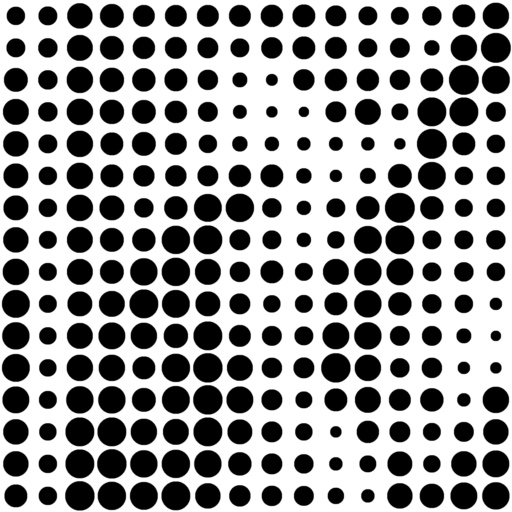

# Halftone

A simple (and in the future hopefully more complete) python utility to convert an image into a halftone image (and export it in either .png or .svg).


### Example

<figure style="display:inline-block">
	
	<figcaption>Original (512px x 512px)</figcaption>
</figure>

<figure style="display:inline-block">
	
	<figcaption>Blocksize: 8px</figcaption>
</figure>

<figure style="display:inline-block">
	
	<figcaption>Blocksize: 16px</figcaption>
</figure>

<figure style="display:inline-block">
	
	<figcaption>Blocksize: 32px</figcaption>
</figure>

<figure style="display:inline-block">
	
	<figcaption>Combined</figcaption>
</figure>

### Usage

```
python halftone.py image.png 8
```
where `8` is an optional parameter specifying the blocksize of the grid that we use to construct the halftone image.
Will export a `.png` file and an `.svg` file into the `out` folder.
